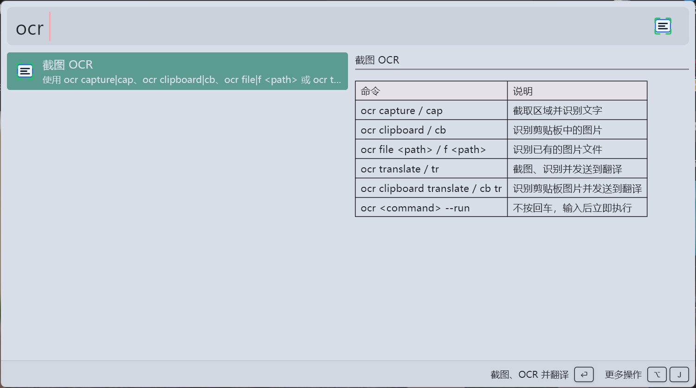
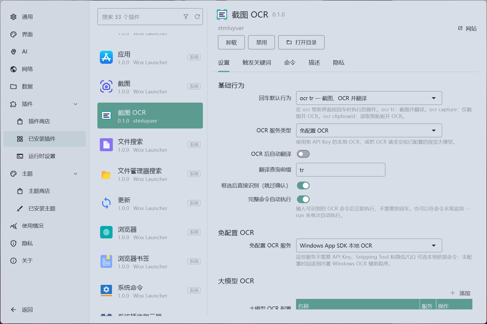
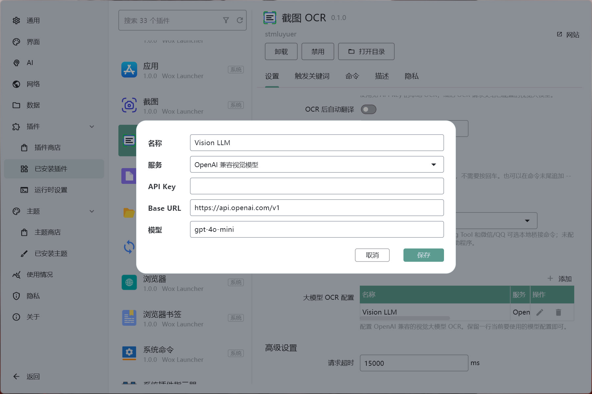

# Screenshot OCR

[English](README.en.md) | [中文](README.md)

Screenshot OCR is a [Wox](https://github.com/Wox-launcher/Wox) plugin for recognizing text from screenshots, clipboard images, or image files. It is designed to work with LuxTranslate through the `tr` query prefix, so the common flow is:

```text
Screenshot -> OCR text recognition -> LuxTranslate -> target language
```

## Features

- `ocr capture` opens a Windows region capture overlay.
- `ocr clipboard` reads an image from the clipboard and runs OCR.
- `ocr file <path>` recognizes an existing local image file.
- `ocr translate` captures, recognizes, and sends the result to LuxTranslate.
- No-setup OCR providers: Windows local OCR, Snipping Tool OCR, and WeChat/QQ OCR.
- Large model OCR through OpenAI-compatible vision models.
- Local deployment script for quick testing in `%USERPROFILE%\.wox\wox-user\plugins`.

## OCR Providers

Screenshot OCR groups OCR providers into two categories:

| Category     | Providers                                                   |
| ------------ | ----------------------------------------------------------- |
| No-setup OCR | Windows App SDK local OCR, Snipping Tool OCR, WeChat/QQ OCR |
| Vision LLM   | OpenAI-compatible vision model                              |

Notes:

- No-setup OCR does not require an API key.
- Windows App SDK local OCR runs offline through Windows Runtime OCR and requires Windows 10 or Windows 11.
- Snipping Tool OCR is intended for Windows 10/11. If a compatible local bridge command is configured, Screenshot OCR can use it; otherwise it falls back to the bundled Windows OCR helper.
- WeChat/QQ OCR requires WeChat or QQ to provide the native OCR path. If no compatible bridge command is configured, Screenshot OCR falls back to the bundled Windows OCR helper.
- Vision LLM OCR sends the image to an OpenAI-compatible `chat/completions` endpoint.

## Installation

The repository is prepared for Wox Store packaging. Publish a GitHub release with the generated `.wox` asset before submitting the store entry.

```bash
git clone https://github.com/stmluyuer/Wox.Plugin.ScreenshotOCR.git
cd Wox.Plugin.ScreenshotOCR
pnpm install
pnpm run build
pnpm run package
```

The build output is written to `dist/`. `pnpm run package` creates `wox.plugin.screenshotocr.wox` for GitHub Releases and Wox Store download URLs.

For local testing, run `pnpm run deploy` to copy `dist/` into the current user's Wox plugin directory, then reload Wox plugins.

## Usage

| Command                                         | Description                                      |
| ----------------------------------------------- | ------------------------------------------------ |
| `ocr`                                           | Show help                                        |
| `ocr capture` / `ocr cap`                       | Capture a screen region and run OCR              |
| `ocr clipboard` / `ocr cb`                      | Recognize the image currently in the clipboard   |
| `ocr file <path>` / `ocr f <path>`              | Recognize an existing image file                 |
| `ocr translate` / `ocr tr`                      | Capture a region, run OCR, and open LuxTranslate |
| `ocr clipboard translate` / `ocr cb tr`         | Recognize clipboard image and open LuxTranslate  |
| `ocr file <path> translate` / `ocr f <path> tr` | Recognize image file and open LuxTranslate       |

Append `--run`, `--go`, or `!` to any executable command to run it immediately after typing, without pressing Enter. Examples: `ocr tr --run` and `ocr cb tr --run`. You can also enable `Auto execute exact commands` in settings to auto-run complete commands.

Recommended Wox query hotkey:

- Query: `ocr translate`
- Silent execution: enabled

## Settings

- `OCR service type`: choose no-setup OCR or vision LLM OCR.
- `No-setup OCR provider`: choose the local OCR provider used in no-setup mode.
- `Auto translate after OCR`: send OCR results to LuxTranslate even for non-translation OCR commands.
- `Auto execute exact commands`: run complete OCR commands immediately after typing.
- `Skip confirm after selection`: start OCR immediately after selecting a capture region.
- `Translate query prefix`: defaults to `tr`.
- `Request timeout`: timeout for vision LLM requests and local OCR bridge commands.
- `Large model OCR settings`: configure API key, base URL, and model in the provider table.

## Development

```bash
pnpm install
pnpm test
pnpm run build
pnpm run deploy
pnpm run package
```

Useful commands:

- `pnpm test`: run Jest tests.
- `pnpm run build`: run lint, format, compile the Windows OCR helper, and bundle the plugin into `dist/`.
- `pnpm run deploy`: copy `dist/` into the local Wox user plugin directory.
- `pnpm run package`: create `wox.plugin.screenshotocr.wox`.
- `pnpm run lint`: run ESLint.

## Workflow

1. Build and deploy the plugin.
2. Run `ocr capture` and verify the Windows selection overlay.
3. Copy an image to the clipboard and run `ocr clipboard`.
4. Configure a vision LLM OCR provider if needed.
5. Run `ocr translate` or `ocr clipboard translate` to hand the OCR text to LuxTranslate.

## Screenshots

- **Command help page**: the full help text shown by the `ocr` command.

  

- **Plugin settings page**: the Wox plugin settings panel.

  

- **Vision LLM OCR settings**: service configuration for OpenAI-compatible vision models.

  

## AI Collaboration Notice

This project was developed with substantial assistance from OpenAI Codex. The author is responsible for requirement design, code review, functional verification, and release decisions.

## License

MIT License. See [LICENSE](LICENSE).
